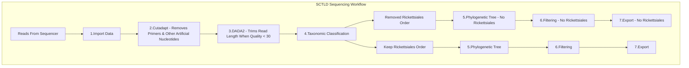

# Qiime2 Pipeline :microbe:
**Project Context:** The Microbial Ecology (16s) and Metatranscriptomics (RNA) of four species of Caribbean coral (Montastraea cavernosa, Orbicella faveolata, Porites astreoides, Acropora cervicornis) from a controlled SCTLD Transmission Experiment. 


Here, we process ~77 of those samples through the Qiime2 pipeline for 16s microbial ecology analysis.
Leveraging 77 unique barcodes, we performed the library prep in house and sequenced the samples in 1 sequencing run. 

> Sequenced the 515F to 806R V4 region of the 16s rRNA on an Illumina MiSeq v3 PE300 with a target read count of ~100,000/sample (before QC filtration).

## Overview



## Reads from Sequencer

I hate to kickoff a tutorial without a solid roadmap but the first hurdle is transferring the reads from your sequencer to your server/computer/external hard drive of preference. This process is going to be specific to who your sequencer is. If they are in the USA, its likely they could upload the data to a storage repository equivalent to dropbox, box, or Illumina Basespace. This simply requires you to download by the click of a button. If they are international, it may be a server-to-server transfer using the "curl" command in terminal or you can try FileZilla as suggestions. If you are lost, reach out to your sequencer and hopefully they will have a standard operating procedure on how to transfer data or suggest steps on how to receive the data.

For this project, the data was uplaoded to box.com and we simply downloaded the data to our computers. Looking at the path below, beyond "Desktop/Autumn16s/" you can see the path "Autumn16s_05082023/230613_M02476_0578_000000000-L3NTN/20230615_222347/" of how the data was saved by the sequencer, which for us was UMiami Medical Center. Some notation interpretation, I see the date the samples began being read on the Miseq v3 (230613) or June 13th 2023, and it takes two-three days to run, so we can see when the sequencing run was compeleted on (20230615) or June 15th 2023. Perhaps your data path has similar clues. 

Within this path is a folder from the sequencer called "Fastq", in it are the .fastq files for each sample that we care about. There are also extra files that dont need to be in here such as the FastqSummarF1L1.txt and two Undetermined files. I removed these files from the Fastq folder and placed them in the parent folder because they prevent the import data file from working as intended and are not relevant to our research investigation.
```
cd Desktop/Autumn16s/Autumn16s_05082023/230613_M02476_0578_000000000-L3NTN/20230615_222347/

mkdir ./DemultiplexedSeqs
mv ./Fastq/FastqSummaryF1L1.txt ./../
mv ./Fastq/Undetermined* ./../
```

## Activate Qiime2 
```
conda activate qiime2-2022.11
```
***Your Qiime2 version will likely be more recent than mine.***

# 1. Import Data

With this style of import, the samples are ALREADY Demultiplexed.

Importing Data - **Casava 1.8 paired-end demultiplexed fastq**

**Note:** You will receive files in different formats from your sequencer. It may not be exactly like mine. For example in my [White Plague Qiime2](https://github.com/nmacknight/Qiime2-WhitePlague/blob/main/White%20Plague%202017%20-%20Educational%20Qiime%202Pipeline.md) page you can see the import style is different. Variation in how you import data are primarly based on if your reads are single-end v paired-end reads, barcoded or not, or demultiplexed or still multiplexed.

In this project, my reads are paired-end demultiplexed reads that were received in a format that reflects the Casava 1.8 paired-end demultiplexed fastq style. 

To read up on which import style is best for your project checkout Qiime2's [Importing Data](https://docs.qiime2.org/2023.2/tutorials/importing/) page.

**Casava 1.8 paired-end demultiplexed fastq**
```
qiime tools import \
  --type 'SampleData[PairedEndSequencesWithQuality]' \
  --input-path Fastq \
  --input-format CasavaOneEightSingleLanePerSampleDirFmt \
  --output-path ./DemultiplexedSeqs/demux-paired-end.qza
```
>Run Time: 20 min

Summary of the demultiplexing results
```
qiime demux summarize \
  --i-data ./DemultiplexedSeqs/demux-paired-end.qza \
  --o-visualization ./DemultiplexedSeqs/demux-paired-end.qzv
```
> RUN TIME: 12 Min.

**View The Interactive Plot.**
```
qiime tools view ./DemultiplexedSeqs/demux-paired-end.qzv
```
> RUN TIME: <1 min.

We will need to remove the adapters before the reads are truncated. To do this, we use Cutadapt in step 2.


# 2. Cutadapt :scissors:

**Removes Primer from Reads**

This trim-paired form of cutadapt will remove any nucelotides that are before and including the provided sequence on the front and reverse read of the sequence. This removes non-biological sequence data.

## Primers
**515F forward primer, barcoded**
1. 5′ Illumina adapter
2. Golay barcode
3. Forward primer pad
4. Forward primer linker
5. Forward primer (515F)
AATGATACGGCGACCACCGAGATCTACACGCT XXXXXXXXXXXX TATGGTAATT GT GTGYCAGCMGCCGCGGTAA

**806R reverse primer**

1. Reverse complement of 3′ Illumina adapter
2. Reverse primer pad
3. Reverse primer linker
4. Reverse primer (806R)
CAAGCAGAAGACGGCATACGAGAT AGTCAGCCAG CC GGACTACNVGGGTWTCTAAT

So in the command below you can see we used the Forward primer (515F) "GTGYCAGCMGCCGCGGTAA" and Reverse primer (806R) "GGACTACNVGGGTWTCTAAT" as our consistent artifical nucleotides to direct cutadapt to remove any nucleotides before the forward primer, or after the reverse primer. 
```
qiime cutadapt trim-paired \
  --i-demultiplexed-sequences ./DemultiplexedSeqs/demux-paired-end.qza \
  --p-front-f GTGYCAGCMGCCGCGGTAA \
  --p-front-r GGACTACNVGGGTWTCTAAT \
  --o-trimmed-sequences ./DemultiplexedSeqs/demux-paired-end-trimmed.qza
```
> Run time: 10 Min.

Summary of the demultiplexing results
```
qiime demux summarize \
  --i-data ./DemultiplexedSeqs/demux-paired-end-trimmed.qza  \
  --o-visualization ./DemultiplexedSeqs/demux-paired-end-trimmed.qzv
```

>RUN TIME: 12 Min.

**View The Interactive Plot.**
**Rule of Thumb:** ***Truncate when black bars begin to consistently go below a Quality Score of 30.***
```
qiime tools view ./DemultiplexedSeqs/demux-paired-end-trimmed.qzv
```
 Now that you have removed the primers, look at the first 40 nucleotides or so and you can see how the .qzv files differ between demux-paired-end.qzv and demux-paired-end-trimmed.qzv to visually confirm cutadapt removed your primers. 


# 3. DADA2

**Chops the read length where the quality begins to become poor.**
**Note:** Update the number after "--p-trunc-len-f" and "--p-trunc-len-r" to reflect YOUR cutoff point as determined after looking at the demux-paired-end-trimmed.qzv figures produced by the command above. While looking at the Interactive Plots tab in demux-paired-end-trimmed.qzv, you will see black bars begin to become lower in the graph. When these black bars consistently begin to reach a quality score of 30 or lower, I note that length (x-axis) where this begins and thats my cutoff length. Do this for both Forward and Reverse graphs.

```
mkdir ./DADA2
qiime dada2 denoise-paired \
  --i-demultiplexed-seqs ./DemultiplexedSeqs/demux-paired-end-trimmed.qza \
  --p-trim-left-f 0 \
  --p-trunc-len-f 234 \
  --p-trim-left-r 0 \
  --p-trunc-len-r 171 \
  --o-representative-sequences ./DADA2/rep-seqs-dada2.qza \
  --o-table ./DADA2/table-dada2.qza \
  --o-denoising-stats ./DADA2/stats-dada2.qza
```
> RUN TIME: 25 minutes (315mb demux.qza), 40 minutes for (463mb demux.qza)), or 14 hours (11gb demux.qza file). 
> File size depends on read depth and number of samples you are working with. I provided some previous times for previous projects to give you an estimate. For this project, the demux.qza was 315mb. 

Visualizing DADA2 output
```
qiime metadata tabulate \
  --m-input-file ./DADA2/stats-dada2.qza \
  --o-visualization ./DADA2/stats-dada2.qzv
qiime feature-table summarize \
  --i-table ./DADA2/table-dada2.qza \
  --o-visualization ./DADA2/table-dada2.qzv \
  --m-sample-metadata-file D1D2-metadata.tsv
qiime feature-table tabulate-seqs \
  --i-data ./DADA2/rep-seqs-dada2.qza \
  --o-visualization ./DADA2/rep-seqs-dada2.qzv
```
> Run Time < 1 min.

Rename Samples
```
qiime feature-table rename-ids \
  --i-table table-dada2.qza \
  --m-metadata-file ../Rename_Metadata.tsv \
  --m-metadata-column NewID \
  --p-axis 'sample' \
  --p-no-strict \
  --o-renamed-table table-dada2v2.qza
```
>Run Time < 1 min.

**Summary of artifact**
```
qiime feature-table summarize \
  --i-table table-dada2v2.qza \
  --o-visualization table.qzv \
  --m-sample-metadata-file ../metadata.tsv
```
>Run time: < 1 min.

View
```
qiime tools view table.qzv
```

```
qiime feature-table tabulate-seqs \
	--i-data rep-seqs-dada2.qza \
	--o-visualization rep-seqs-dada2.qzv
```
>Run Time <1 min.

## VSearch ##
**This vsearch command is clustering sequences that are 100% identical by referencing the merged-rep-seqs and then references the merged-table to ADD the frequencies (counts) of any clustered ASV.
```
qiime vsearch cluster-features-de-novo \
  --i-sequences ./rep-seqs-dada2.qza \
  --i-table ./table-dada2v2.qza \
  --p-perc-identity 1 \
  --o-clustered-table clustered-table.qza \
  --o-clustered-sequences clustered-seqs.qza 
```
> Run Time: 5 min.


```
qiime feature-table summarize \
  --i-table clustered-table.qza \
  --o-visualization clustered-table.qzv \
  --m-sample-metadata-file ../metadata.tsv
```
>Run time: < 1 min.

**View**
```
qiime tools view clustered-table.qzv

qiime feature-table tabulate-seqs \
	--i-data clustered-seqs.qza \
	--o-visualization clustered-rep-seqs.qzv
```
> Run Time <1 min.


# 4. Taxonomic Classification :paw_prints:

This is where we assign our ASV's (our representative sequences) a biological name.

We are using the silva database. There is also the greengenes database. At the time of this project (Feb 2023), the silva was more recently updated than the greengenes database. 

The qiime2 tutorial has a lot ot say about classifiers i.e. databases. Fortunately, the 515F to 806R is super common in microbial ecology analysis that they have these prepared ones for us. In my [White Plague Qiime2](https://github.com/nmacknight/Qiime2-WhitePlague/blob/main/White%20Plague%202017%20-%20Educational%20Qiime%202Pipeline.md) page you can see that I assembled my own classifier if you are curious on doing that and want an example. I used the greengenes for that one too but that was because at the time of that project (2017) the greengenes was not "outdated". 

Anyways, back to THIS project, where we use the silva database. 
```
qiime feature-classifier classify-sklearn \
  --i-classifier ../silva-138-99-515-806-nb-classifier.qza \
  --i-reads clustered-seqs.qza \
  --o-classification taxonomy.qza
```
> Run time Awhile. Run this overnight.

```
qiime feature-table filter-features \
  --i-table clustered-table.qza \
  --m-metadata-file taxonomy.qza \
  --o-filtered-table id-filtered-table-cl.qza
```
>Run time: < 1 min.

Visualize
```
qiime metadata tabulate \
  --m-input-file taxonomy.qza \
  --o-visualization taxonomy.qzv
```
>Run Time: < 1 min.

View
```
qiime tools view taxonomy.qzv
```

Visualize
```
qiime taxa barplot \
  --i-table clustered-table.qza \
  --i-taxonomy taxonomy.qza \
  --m-metadata-file ../metadata.tsv \
  --o-visualization taxa-bar-plots.qzv
```
>Run Time: ~ 2 min.

View
```
qiime tools view taxa-bar-plots.qzv
```

**Filtering out Chloroplast and Mitochondria From Dataset**
There is a lot of chloroplast from Osteobium sp. perhaps. Lets remove them.
Also Filtering out incorrectly annotated ASVs that dont have phylum level annotation(p__) From Dataset
```
qiime taxa filter-table \
  --i-table clustered-table.qza \
  --i-taxonomy taxonomy.qza \
  --p-exclude mitochondria,chloroplast \
  --p-include d__Bacteria,d__Archaea \
  --o-filtered-table table-BacArc-cl.qza
```
>Run Time: < 1 min.

**Removing incorrectly annotated bacteria that dont have phylum-level classification.**
```
qiime taxa filter-seqs \
  --i-sequences rep_seqs_BacArc-cl.qza \
  --i-taxonomy taxonomy.qza \
  --p-include p__ \
  --o-filtered-sequences rep_seqs_BacArc-cl.qza
```
>Run Time: < 1 min.
```
qiime feature-table summarize \
  --i-table table-BacArc-cl.qza \
  --o-visualization table-BacArc-cl.qzv \
  --m-sample-metadata-file sample-metadata.tsv
```
>Run Time: < 1 min.

```
qiime feature-table tabulate-seqs \
--i-data rep_seqs_BacArc-cl.qza \
--o-visualization rep_seqs_BacArc-cl.qzv
```
>Run Time: < 1 min.

```
qiime taxa barplot \
  --i-table table-BacArc-cl.qza  \
  --i-taxonomy taxonomy.qza \
  --m-metadata-file ../metadata.tsv\
  --o-visualization taxa-bar-BacArc-cl.qzv
```
>Run Time: ~ 2 min.
```
qiime tools view taxa-bar-BacArc-cl.qzv
```
### Removing Rickettsiales
> Rickettsiales has a lineage-specific symbiosis with Acropora cervicornis where its realtive abundance in this study was between 90-98% of the Acerv microbiome community. This makes intraspecies comparisons impossible. So we remove it so that we can investigate the other bacteria in this coral host that are responding to SCTLD exposure and compare those bacteria across coral species.
```
qiime taxa filter-table \
  --i-table table-BacArc-cl.qza \
  --i-taxonomy taxonomy.qza \
  --p-exclude rickettsiales \
  --p-include p__ \
  --o-filtered-table table-NoRick.qza
```
>Run Time: < 1 min.
```
qiime taxa filter-seqs \
  --i-sequences rep_seqs_BacArc-cl.qza \
  --i-taxonomy taxonomy.qza \
  --p-exclude rickettsiales \
  --p-include p__ \
  --o-filtered-sequences rep_seqs_NoRick.qza
```
>Run Time: < 1 min.
```
qiime feature-table summarize \
  --i-table table-NoRick.qza \
  --o-visualization table-NoRick.qzv \
  --m-sample-metadata-file ../metadata.tsv
```
>Run Time: < 1 min.

```
qiime feature-table tabulate-seqs \
--i-data rep_seqs_NoRick.qza \
--o-visualization rep_seqs_NoRick.qzv
```
>Run Time: < 1 min.

```
qiime taxa barplot \
  --i-table table-NoRick.qza  \
  --i-taxonomy taxonomy.qza \
  --m-metadata-file ../metadata.tsv\
  --o-visualization taxa-bar-NoRick.qzv
```
>Run Time: ~ 2 min.

```
qiime tools view taxa-bar-NoRick.qzv
```
# 5. Generate a Phylogenetic Tree

```
mkdir PhylogeneticTree
qiime phylogeny align-to-tree-mafft-fasttree \
  --i-sequences rep_seqs_BacArc.qza \
  --o-alignment ./PhylogeneticTree/aligned-rep-seqs.qza \
  --o-masked-alignment ./PhylogeneticTree/masked-aligned-rep-seqs.qza \
  --o-tree ./PhylogeneticTree/unrooted-tree.qza \
  --o-rooted-tree ./PhylogeneticTree/rooted-tree.qza
```
>RunTime: 20 minutes. Large projects (1600 samples) take 2.5 days to make the above tree. 

### NoRick Phylogenetic Tree
```
mkdir PhylogeneticTree_NoRick
qiime phylogeny align-to-tree-mafft-fasttree \
  --i-sequences rep_seqs_NoRick.qza \
  --o-alignment ./PhylogeneticTree/aligned-rep-seqs-NoRick.qza \
  --o-masked-alignment ./PhylogeneticTree/masked-aligned-rep-seqs-NoRick.qza \
  --o-tree ./PhylogeneticTree/unrooted-tree-NoRick.qza \
  --o-rooted-tree ./PhylogeneticTree/rooted-tree-NoRick.qza
```
# 6. Filtering
```
mkdir ../Rarefaction
qiime diversity alpha-rarefaction \
  --i-table ./table-BacArc-cl.qza \
  --p-max-depth 20000 \
  --m-metadata-file ../metadata.tsv \
  --o-visualization ../Rarefaction/table-BacArc_20k.qzv
```

**Min Read depth of 10**
```
qiime feature-table filter-features \
  --i-table table-BacArc-cl.qza \
  --p-min-frequency 10 \
  --o-filtered-table ../Rarefaction/table-BacArc_Fr10.qza
```

**Min Frequency of 10% samples**
```
qiime feature-table filter-features \
  --i-table ../Rarefaction/table-BacArc_Fr10.qza \
  --p-min-samples 10 \
  --o-filtered-table ../Rarefaction/table-BacArc_Fr10S10.qza
```
```
qiime diversity alpha-rarefaction \
  --i-table ../Rarefaction/table-BacArc_Fr10S10.qza \
  --p-max-depth 50000 \
  --m-metadata-file ../metadata.tsv \
  --o-visualization ../Rarefaction/table-BacArc_50k_Fr10S10.qzv
```
```
qiime tools view ../Rarefaction/table-BacArc_50k_Fr10S10.qzv
```
```
qiime feature-table summarize \
  --i-table ../Rarefaction/table-BacArc_Fr10S10.qza \
  --o-visualization ../Rarefaction/table-BacArc_Fr10S10.qzv \
  --m-sample-metadata-file ../metadata.tsv
```
```
qiime tools view ../Rarefaction/table-BacArc_Fr10S10.qzv
```

## 6B. Filtering - No Rickettsiales

```
mkdir ../Rarefaction_NoRick
qiime diversity alpha-rarefaction \
  --i-table ./table-NoRick.qza \
  --p-max-depth 20000 \
  --m-metadata-file ../metadata.tsv \
  --o-visualization ../Rarefaction_NoRick/table-NoRick_20k.qzv
``` 

**Min Read depth of 10**
```
qiime feature-table filter-features \
  --i-table table-NoRick.qza \
  --p-min-frequency 10 \
  --o-filtered-table ../Rarefaction_NoRick/table-NoRick_Fr10.qza
```
**Min Frequency of 10% samples**
```
qiime feature-table filter-features \
  --i-table ../Rarefaction_NoRick/table-NoRick_Fr10.qza \
  --p-min-samples 10 \
  --o-filtered-table ../Rarefaction_NoRick/table-NoRick_Fr10S10.qza
```
```
qiime diversity alpha-rarefaction \
  --i-table ../Rarefaction_NoRick/table-NoRick_Fr10S10.qza \
  --p-max-depth 50000 \
  --m-metadata-file ../metadata.tsv \
  --o-visualization ../Rarefaction_NoRick/table-NoRick_50k_Fr10S10.qzv
```
```
qiime tools view ../Rarefaction_NoRick/table-NoRick_50k_Fr10S10.qzv
```
```
qiime feature-table summarize \
  --i-table ../Rarefaction_NoRick/table-NoRick_Fr10S10.qza \
  --o-visualization ../Rarefaction_NoRick/table-NoRick_Fr10S10.qzv \
  --m-sample-metadata-file ../metadata.tsv
```
```
qiime tools view ../Rarefaction_NoRick/table-NoRick_Fr10S10.qzv
```

# 7. Export

**No Rickettsiales table Export**

Export Reads and Taxonomy files
```
qiime tools export \
	--input-path ../Rarefaction_NoRick/table-NoRick_Fr10S10.qza \
	--output-path table_NoRick_Fr10S10
```
>Run Time: < 1 min.
Export Phylogenetic Tree
```
qiime tools export \
	--input-path ./PhylogeneticTree/rooted-tree-NoRick.qza \
	--output-path rooted-tree-NoRick
```
>Run Time: < 1 min.
```
qiime tools export \
	--input-path taxonomy.qza \
	--output-path taxonomy
```
>Run Time: < 1 min.
```
biom  convert \
-i ./table_NoRick_Fr10S10/feature-table.biom \
--to-tsv \
-o ./table_NoRick_Fr10S10/feature-table_Fr10S10_NoRick.txt
#wc -l  table.txt
```

Congrats, ya did it! You have completed a Qiime2 Microbial Ecology Analysis! :clinking_glasses:

Do me a favor, let me know if parts of this pipeline were confusing to you. Through user feedback it will be improved.
nicholas.macknight@noaa.gov
nicholas.macknight@gmail.com

You are now ready to continue in R for statistical analysis using the feature-table_Fr10S10_NoRick.txt. 
